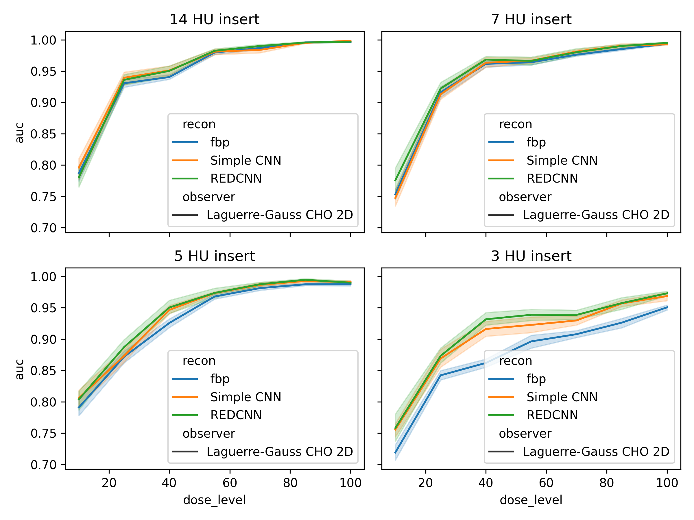

Start by

1. [X] downloading the pretrained denoising models from the [Denoising tutorial](https://colab.research.google.com/drive/1N8V56eHEx3uIWIahBvRGAorszAziyAs7#scrollTo=FxrP4SiMdmUT)
    - might need to add a model save option
2. [X] download the [LCD toolkit and dataset](https://github.com/DIDSR/LCD_CT)
3. [X] Use the downloaded denoisers to process the CCT189 images
4. [X] Use the LCD toolkit to evaluate the two models trained in the tutorial (see if VGG actually made a difference)
5. save that tutorial as a new "advanced tutorial" for the LCD toolkit
6. next get a baseline performance of these models with PED-ETK
7. start developing data aug and compare reevaluate comparing against previous baselines

These are the preliminary results for the standard LCD CT (step 4)

TODO Fix: headers of mhd files in peds dataset to remove spaces "    "
TODO change process_CCT189.py to give folder names to the recon type rather than fbp