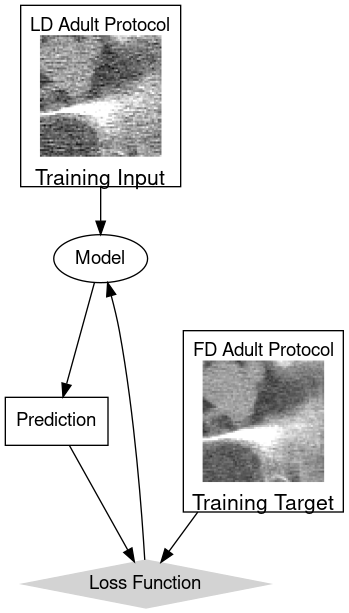

# Noise Texture Augmentation Improves Pediatric Generalizability in Deep Learning CT Denoising Models

Running Title: *Pediatric CT Noise Texture Augmentation*

## Purpose

This repository contains runable code to reproduce the figures in the article "Noise Texture Augmentation Improves Pediatric Generalizability in Deep Learning CT Denoising Models" by Nelson et al 2024.

The digital phantom dataset can be reproduced using [pediatricIQphantoms](https://github.com/DIDSR/pediatricIQphantoms) or downloaded directly from [Zenodo](https://zenodo.org/doi/10.5281/zenodo.10064035)

[](https://doi.org/10.5281/zenodo.11267694)

## Abridged Abstract

Adult-trained CT denoising models were shown to perform poorly in pediatric CT due to Field-of-view (FOV) differences between adult and pediatric CT protocols. This project use noise patches from pediatric protocol phantom scans to augment training with adult datasets. This technique can improve performance in smaller-pediatric patients not represented in the training dataset.

## Index

Figures 1, 2 can be found in [00_characterizing_noise_augmentation.ipynb](notebooks/00_characterizing_noise_augmentation.ipynb)


*Figure 1a Traditional model training where training input patches are input to a model to make a prediction that is compared against the training target using the loss function to update the model.*


*Figure 1b In noise texture augmented training noise patches are added to the low noise training target to make new augmented inputs. While training, a proportion λ of the training data mini batch is from the augmented inputs while the remaining 1 − λ is from the original low dose training inputs.*


*Figure 2b Subtracting the repeat scans yields size-specific noise images*

Figure 3 can be found in [01_train_denoiser_with_augmentation.ipynb](notebooks/01_train_denoiser_with_augmentation.ipynb)


*Figure 3 Selection of  λ value from a central region of interest (ROI) standard deviation (std) measurement averaged across pediatric-sized uniform water phantom images from the validation dataset*

Figure 4, 5, 6, 9 can be found in [02_denoising efficiency.ipynb](notebooks/02_denoising_efficiency.ipynb)


*Figure 4 CT simulations of XCAT anthropomorphic phantoms of different effective diameter reconstructed with Filtered back projection (FBP) followed by denoising with different deep learning denoising models. Region of interest (ROI) measurements, shown as blue disk overlays, taken from the liver report pixel mean and standard deviation with the ROI.*


*Figure 5 Denoising efficiency as a function of phantom size with body fitting reconstructed field of view (FOV). a) Noise reduction performance defined as reduction of pixel intensity standard deviation (std) relative to filtered backprojection (fbp): noise std reduction [%] = [fbp std - denoised std]/fbp std ×100%. Noise in uniform phantoms is measured in central circular regions of interest (ROIs) 40% the phantom diameter. In anthropomorphic phantoms, the ROI size was set at 30% phantom effective diameter and only applied to slices where there was enough liver to fit the ROI, see Figure 4 for examples. b) Noise reduction performance defined as reduction in root mean squared error (rmse) with the ground truth simulated phantom: rmse reduction [%] = [fbp rmse – denoised rmse]/fbp rmse ×100%.*


*Denoising performance measured as pixel intensity standard deviation (std) measured in liver regions of interest (ROIs) from anthropomorphic phantoms. The ROI size was set at 30% phantom effective diameter and only applied to slices where there was enough liver to fit the ROI, see Figure 4 for examples. Pediatric subgroups are based on the waist diameters defined in Table 2.*


*Figure 9 Physical image quality (IQ) phantom scan validation experiment. a) Uniform region for noise assessment in physical ACR464 phantom scanned on a Siemens Edge Plus scanner (see Table 2 for details). b) ACR phantom reconstructed at 3 fields of view (FOVs) estimating adult, child, and infant scan conditions. c) Simulated images of uniform phantom defined at adult, child, and newborn size.*


Figure 7 can be found in [03_sharpness_preservation.ipynb](notebooks/03_sharpness_preservation.ipynb)


*Figure 7 Image sharpness evaluated as 50% and 10% cutoff frequencies of modulation transfer function (MTF) measured from radially averaged disk measurements at different contrast levels, shown as the title of each plot. Average MTF cutoffs values are shown for each pediatric subgroup based on phantom diameter (Table 1) with error bars representing the 95% bootstrap confidence interval.*

Figure 8 can be found in [04_task_performance.ipynb](notebooks/04_task_performance.ipynb)


*Figure 8 Low contrast detectability area under the receiver operator characteristic curve (AUC) as a function of phantom diameter from quarter dose test images. Detectability is assessed using two model observers: a Laguerre-Gauss Channelized Hotelling observer (LG-CHO) and a non-prewhitening (NPW) observer. The 3 HU contrast lesion has a diameter of 10% the phantom diameter and the 14 HU diameter is 5% the phantom diameter.*

## Reproducing all figures

### Requirements

If running on your local machine 2 datasets are required:

1. [pediatricIQphantoms dataset](https://zenodo.org/doi/10.5281/zenodo.10064035) which contains pediatric-sized versions of uniform water, CCT189 MITA-LCD, and CTP404 phantoms based off of of the [Catphan 600 phantom](https://www.phantomlab.com/catphan-600), this dataset is used for evaluating the deep learning denoising model and augmentation method
2. Mayo Clinic Low Dose Grand Challenge Dataset: [https://doi.org/10.7937/9npb-2637](https://www.cancerimagingarchive.net/collection/ldct-and-projection-data/), required for training the deep learning denoising models in [01_train_denoiser_with_augmentation.ipynb](notebooks/01_train_denoiser_with_augmentation.ipynb)
3. `git clone https://github.com/DIDSR/LCD_CT.git`, used for low contrast detectability assessments in [04_task_performance.ipynb](notebooks/04_task_performance.ipynb)

Run the following either all at once or line by line to run the contents of each notebook non-interactively to update/reproduce the figures in [notebooks/results](notebooks/results)

```bash
  jupyter nbconvert notebooks/00_characterizing_noise_augmentation.ipynb --execute --to notebook --inplace
  jupyter nbconvert notebooks/01_train_denoiser_with_augmentation.ipynb --execute --to notebook --inplace
  jupyter nbconvert notebooks/02_denoising_efficiency.ipynb --execute --to notebook --inplace
  jupyter nbconvert notebooks/03_sharpness_preservation.ipynb --execute --to notebook --inplace
  jupyter nbconvert notebooks/04_task_performance.ipynb --execute --to notebook --inplace
```

If you are having issues, please let us know.
[brandon.nelson@fda.hhs.gov](mailto:brandon.nelson@fda.hhs.gov); [rongping.zeng@fda.hhs.gov](rongping.zeng@fda.hhs.gov)

## Disclaimer

This software and documentation (the "Software") were developed at the Food and Drug Administration (FDA) by employees of the Federal Government in the course of their official duties. Pursuant to Title 17, Section 105 of the United States Code, this work is not subject to copyright protection and is in the public domain. Permission is hereby granted, free of charge, to any person obtaining a copy of the Software, to deal in the Software without restriction, including without limitation the rights to use, copy, modify, merge, publish, distribute, sublicense, or sell copies of the Software or derivatives, and to permit persons to whom the Software is furnished to do so. FDA assumes no responsibility whatsoever for use by other parties of the Software, its source code, documentation or compiled executables, and makes no guarantees, expressed or implied, about its quality, reliability, or any other characteristic. Further, use of this code in no way implies endorsement by the FDA or confers any advantage in regulatory decisions. Although this software can be redistributed and/or modified freely, we ask that any derivative works bear some notice that they are derived from it, and any modified versions bear some notice that they have been modified.

## Additional Resources

- https://github.com/DIDSR/pediatricIQphantoms
- https://github.com/DIDSR/LCD_CT
